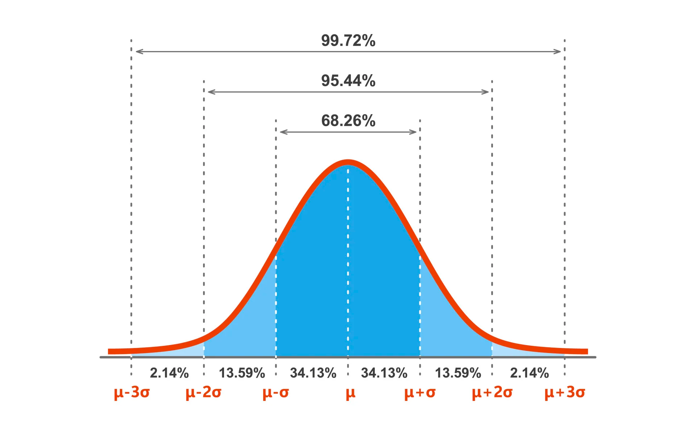

## Binomial Distribution

Experiment should consist of two trials, each trial should result in two  possible outcomes and the outcome of one trial should be independent of other.

## Examples
Q the daily sale of flat panel TVs at store is given by:

| x | P(X=x) |
|---|--------|
| 0 | 0.40   |
| 1 | 0.25   |
| 2 | 0.20   |
| 3 | 0.05   |
| 4 | 0.10   |

- What is the probbility of one sale
- Probability of selling atleast 3 TVs
## Parameters

- \( n \): The number of trials.
- \( p \): The probability of success on each trial.
- \( k \): The number of successes.

## Probability Mass Function (PMF)

The probability mass function of the binomial distribution is given by:

\[ P(X = k) = \binom{n}{k} \cdot p^k \cdot (1 - p)^{n - k} \]

Where:
- \( \binom{n}{k} \) represents the binomial coefficient, also known as "n choose k", which calculates the number of ways to choose \( k \) successes out of \( n \) trials.
- \( p^k \) represents the probability of \( k \) successes.
- \( (1 - p)^{n - k} \) represents the probability of \( n - k \) failures.

## Mean and Variance

The mean (expected value) of a binomial distribution is given by:

\[ \mu = n \cdot p \]

The variance of a binomial distribution is given by:

\[ \sigma^2 = n \cdot p \cdot (1 - p) \]

## Applications

The binomial distribution is commonly used in various fields, including:

- **Biological Sciences**: Modeling genetic inheritance.
- **Quality Control**: Determining the probability of defective items in a production batch.
- **Finance**: Assessing the risk of investment portfolios.
- **Election Forecasting**: Predicting the outcomes of elections.
- **Sports Analytics**: Analyzing game outcomes.

## Normal Distribution
- Continuous Random Variable x has normal distribution if values fall under a smooth curve i.e. every normal distribution has a mean (mu) standard deviation (delta) 
- Shape of normal distribution is symmetric around 
- Mean Median and Mode of Normal Distribution are equal
- Area under the curve is 1
- Normal distributions are denser in the center and less in the tails.

#### Rules:
- 68% of the area is within one standard deviation of the mean
- 95% of the data are within two standard deviation of the mean
- 99.7% of the data is within 3 standard deviation of the mean

### Z-Score
Z score make the use of mean and Standard deviation of the dtaset in order to specify the relative location of a measurement. For Eg: 23 age is -1.4 units away from the standard deviation mean (example in class).
It represents the distance between given datapoint and the mean expressen in the standard deveation.
Z score is also known as standardising the data point. Large Z-Scores tells us that the measurement is larger than almost all other measurements in the data set.
Small Z score tells us that the measurement is smaller than all other measurements.
If Z score is zero, then the observation lies on the mean.

Z = Xi - Mu / sigma